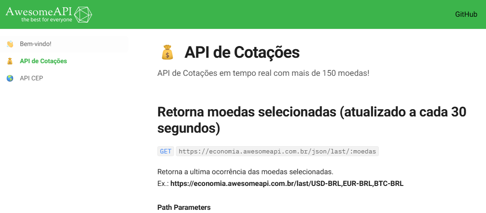

# Indice

[Descricao](#descrição)

[tecnologias_utilizadas](#tecnologias-utilizadas)

[imagens_demonstrativas](#imagens-demonstrativas)

[autor](#autor)

## Pegando A URL da API

    Antes de começar o código você deve ter acesso a API do site "Awesome-API". 

    Onde coloca código da API 👇

## Descrição

    Uma ferramenta simples e eficiente para converter valores entre diversas moedas, utilizando as taxas de câmbio mais   atualizadas do mercado.

### Funcionalidades:

    Conversão rápida e precisa de moedas populares.
    Interface intuitiva e responsiva para todos os dispositivos.
    Taxas de câmbio atualizadas em tempo real.
    Histórico de conversões (futura atualização).

### Como funciona:

    *Selecione as moedas*: Escolha a moeda de origem e a moeda de destino nos menus dropdowns.
    Insira o valor: Digite o valor que deseja converter.
    Clique em "Converter": O resultado será exibido instantaneamente.

### Arquitetura:

    A aplicação utiliza HTML para estruturar a página, CSS para estilizar a interface e JavaScript para a lógica da aplicação. O JavaScript faz uma requisição à API para obter as taxas de câmbio e realiza os cálculos necessários para a conversão. A interface é responsiva, adaptando-se a diferentes tamanhos de tela através do uso de media queries e flexbox.

## Imagens demonstrativas:

## HTML

## CSS

## JavaScript

## Tecnologias utilizadas:

* API:  https://economia.awesomeapi.com.br/last/USD-BRL,EUR-BRL,BTC-BRL
 
* [<code></code>](https://developer.mozilla.org/pt-BR/docs/Web/HTML)
* [<code></code>](https://github.com/)
* [<code></code>](https://git-scm.com/)
* [<code></code>](https://code.visualstudio.com/)
* [<code></code>](https://fontawesome.com/versions)
 

## Autor:
|  [ Luan Alencar](https://github.com/luan18alencar) |  
| :---: |

